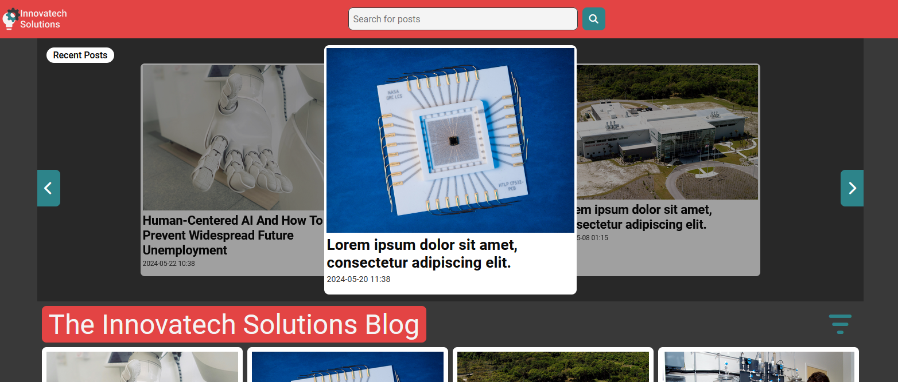

# FED1-Project-Exam-1



This was the project exam for the first year of Frontend Development and Noroff School of Technology and Digital Media.

## Description

This project is a blog website for a fictitious tech R&D company.
It uses the blog endpoint from the Noroff API to fetch blog posts and display them on the website.

### Features:
- The website is responsive.
- Home page:
  - Blog feed.
  - Pagination.
  - Search bar.
  - Carousel of blog posts with the three most recent posts.
- Blog post page with the full blog post.
- Admin pages for managing blog posts, including creating, updating, and deleting blog posts.
- Login and register pages.

### Built with

-Figma (Design and prototype)  
-HTML  
-CSS  
-JS  

## Installing
Clone the project repository to your local machine.
```bash
git clone https://github.com/Eikhaugen/FED1-Project-Exam-1.git
```
### Running

Use webstorm, VSCode or any other code editor to run the project using liveserver.

## Contact

Find me here:

[My LinkedIn page](www.linkedin.com)
[My GitHub page](https://github.com/Eikhaugen)

